# docker_v1.12 - Swarm Tutorials

## Setting UP

> Three ubuntu machines in openstack under `Docker-Swarm` project

|Name|IP|
|:---:|:---:|
|manager1|192.168.0.52|
|worker-1|192.168.0.53|
|worker-2|192.168.0.54|

> Installing Docker-1.12 on ubuntu-trusty

  - Update the machine `sudo apt-get update`

  - Installing certificates `sudo apt-get install apt-transport-https ca-certificates`

  - Adding APT key
      ```
      sudo apt-key adv --keyserver hkp://p80.pool.sks-keyservers.net:80 --recv-keys 58118E89F3A912897C070ADBF76221572C52609D`
      ```

  - Add an APT-source entry
    - Edit/Create a file `vim /etc/apt/sources.list.d/docker.list`
    - Add an entry `deb https://apt.dockerproject.org/repo ubuntu-trusty main`

      (or)

    - Just run
        ```
        sudo echo 'deb https://apt.dockerproject.org/repo ubuntu-trusty main' > /etc/apt/sources.list.d/docker.list`
        ```

  - Run update to update the APT-source entry `sudo apt-get update`

  - To purge existing docker `sudo apt-get purge lxc-docker`

  - Verify that APT is pulling from the right repository `apt-cache policy docker-engine`

  - Prerequisites by Ubuntu Version
      ```
      sudo apt-get install linux-image-extra-$(uname -r) linux-image-extra-virtual
      sudo reboot
      ```

  - Running machine update once again `sudo apt-get update`

  - Installing docker-engine `sudo apt-get install docker-engine`

  - Check the docker version `docker -v`

  - Docker service will be started automatically if not run `sudo service docker start`

## Creating a Docker-Swarm visualizer

We gonna use docker [`manomarks/visualizer`](https://hub.docker.com/r/manomarks/visualizer/) image to get a clear idea about docker swarm.

Run the following command on the master node

```
docker run -it -d -p 5000:8080 -v /var/run/docker.sock:/var/run/docker.sock manomarks/visualizer
```

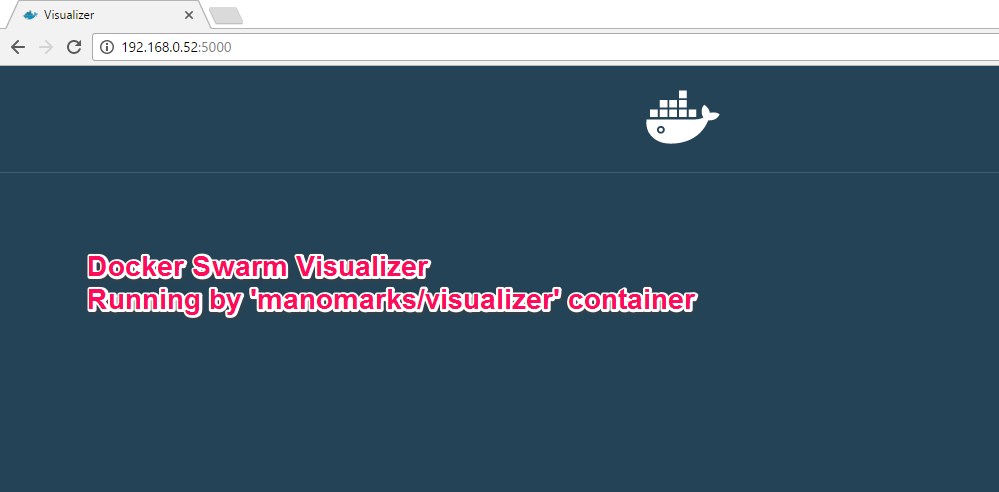

`docker ps` shows the running *manomarks/visualizer* on port *5000*

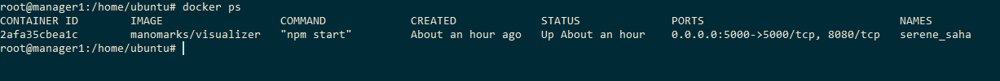

Visit **http://192.168.0.52:5000** in browser to see the running docker-visualizer.

## Creating Swarm Master

On master1 node run the following command

```
docker swarm init --advertise-addr 192.168.0.52
```

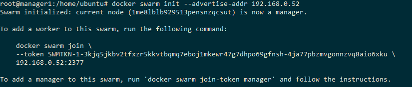

In visualizer you can see the master node

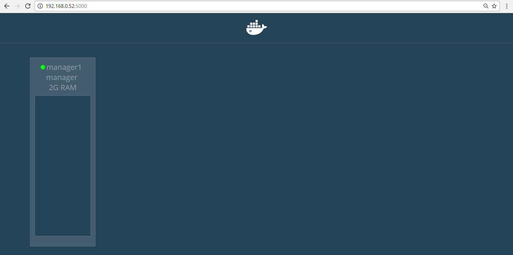

## Attaching Worker Nodes to Swarm Master

On worker-1 node run the following `docker swarm join` command with the token generated on `master1`

```
docker swarm join \
--token SWMTKN-1-3kjq5jkbv2tfxzr5kkvtbqmq7eboj1mkewr47g7dhpo69gfnsh-4ja77pbzmvgonnzvq8aio6xku \
192.168.0.52:2377
```

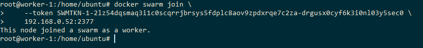

In visualizer you can see the worker-1 node

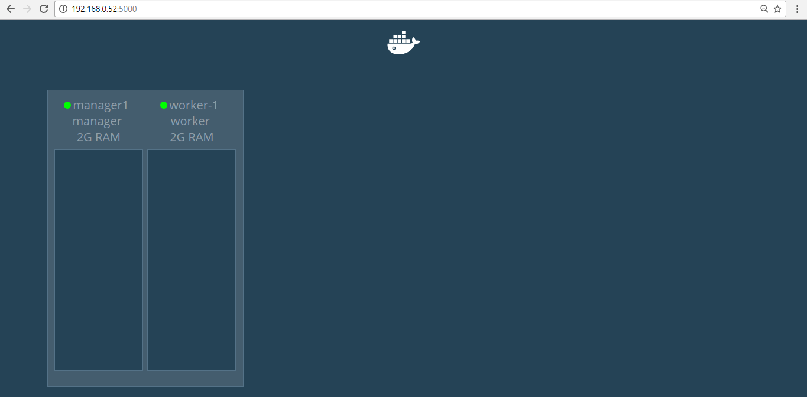

Also on worker-2 node run the same `docker swarm join` command

```
docker swarm join \
--token SWMTKN-1-3kjq5jkbv2tfxzr5kkvtbqmq7eboj1mkewr47g7dhpo69gfnsh-4ja77pbzmvgonnzvq8aio6xku \
192.168.0.52:2377
```

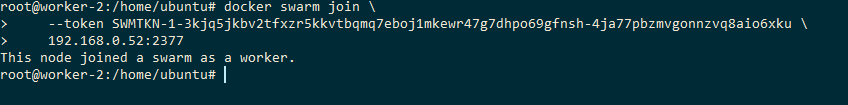

In visualizer you can see the worker-2 node

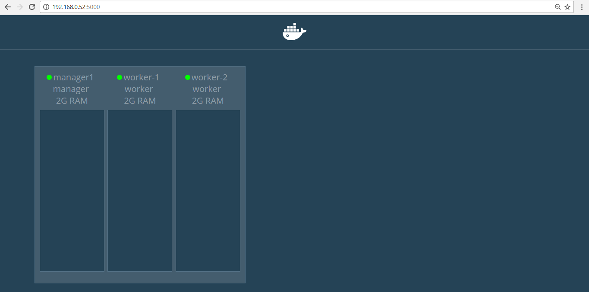

### List of Nodes

Now in master run the below command to see the list of nodes in the swarm.

```
docker node ls
```

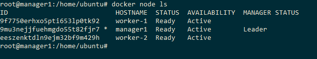

## Deploy a service to the swarm

On Manager node run the following command to deploy a [sample voting service](https://hub.docker.com/r/instavote/vote/) for testing the swarm usage

```
docker service create --replicas 1 --name vote -p 8080:80 instavote/vote
```

- Here we use `docker service create` to run a service in docker swarm

- `--replicas 1` denote the number of running instances

- `-p 8080:80` used for port mapping

- `instavote/vote` is a container we used

To see the list of running services, Run `docker service ls`

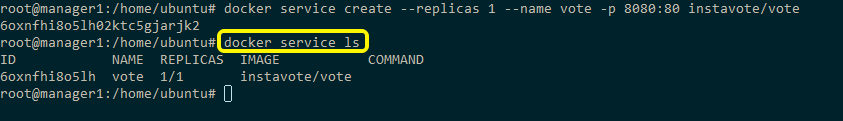

## Inspecting the running service

Run `docker service inspect --pretty <SERVICE-ID>` to display the details about a service in an easily readable format.

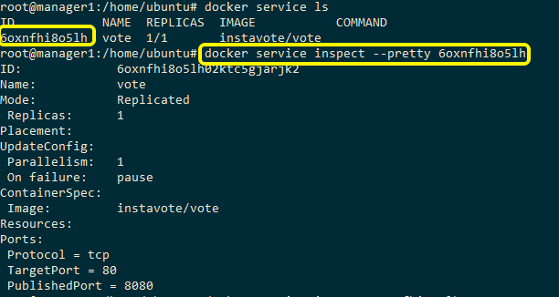

Running `docker service inspect <SERVICE-ID>` without *--pretty* will display the details in **JSON** format

```
root@manager1:/home/ubuntu# docker service inspect 6oxnfhi8o5lh
[
    {
        "ID": "6oxnfhi8o5lh02ktc5gjarjk2",
        "Version": {
            "Index": 42
        },
        "CreatedAt": "2016-10-14T13:23:10.799339539Z",
        "UpdatedAt": "2016-10-14T13:23:10.830455894Z",
        "Spec": {
            "Name": "vote",
            "TaskTemplate": {
                "ContainerSpec": {
                    "Image": "instavote/vote"
                },
                "Resources": {
                    "Limits": {},
                    "Reservations": {}
                },
                "RestartPolicy": {
                    "Condition": "any",
                    "MaxAttempts": 0
                },
                "Placement": {}
            },
            "Mode": {
                "Replicated": {
                    "Replicas": 1
                }
            },
            "UpdateConfig": {
                "Parallelism": 1,
                "FailureAction": "pause"
            },
            "EndpointSpec": {
                "Mode": "vip",
                "Ports": [
                    {
                        "Protocol": "tcp",
                        "TargetPort": 80,
                        "PublishedPort": 8080
                    }
                ]
            }
        },
        "Endpoint": {
            "Spec": {
                "Mode": "vip",
                "Ports": [
                    {
                        "Protocol": "tcp",
                        "TargetPort": 80,
                        "PublishedPort": 8080
                    }
                ]
            },
            "Ports": [
                {
                    "Protocol": "tcp",
                    "TargetPort": 80,
                    "PublishedPort": 8080
                }
            ],
            "VirtualIPs": [
                {
                    "NetworkID": "5t5bl9qk4x8c9oy549xr1j0lb",
                    "Addr": "10.255.0.6/16"
                }
            ]
        },
        "UpdateStatus": {
            "StartedAt": "0001-01-01T00:00:00Z",
            "CompletedAt": "0001-01-01T00:00:00Z"
        }
    }
]
```

Run `docker service ps <SERVICE-ID>` on master to see which nodes are running the service

```
docker service ps 6oxnfhi8o5lh
```

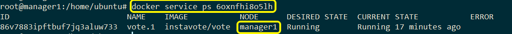

Also we can run `docker ps` on the node where the task is running to see details about the container for the task.

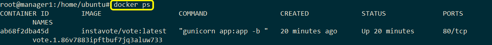

In visualizer we can see the created service and the node in which it is running.

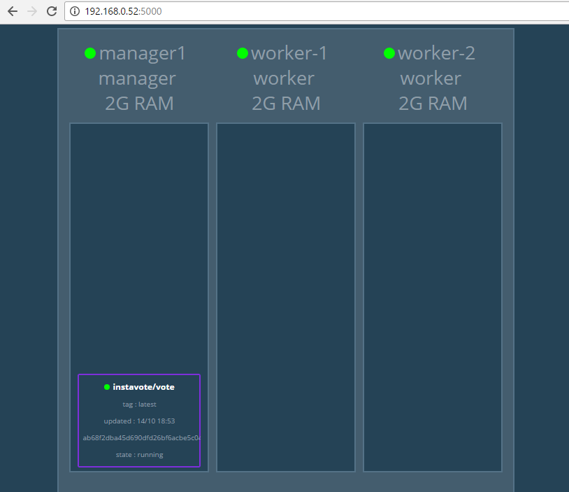

By visiting http://<IP>:8080 in browser we can see the output with a container ID.

- `IP` could be any of master or worker IP's, since it is a swarm service all will be redirected to the same.

- `8080` is the port that we specified while creating the service.

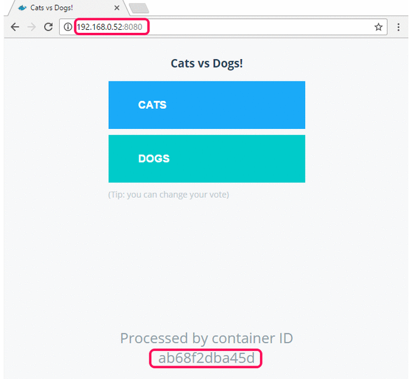

## Service Scale in swarm

In master node running the command `docker service scale <SERVICE-ID>=<NUMBER-OF-TASKS>` will change the desired state of running service in swarm.

```
docker service scale 6oxnfhi8o5lh=6
```

Run `docker service ls` to see the current state of **Replicas**

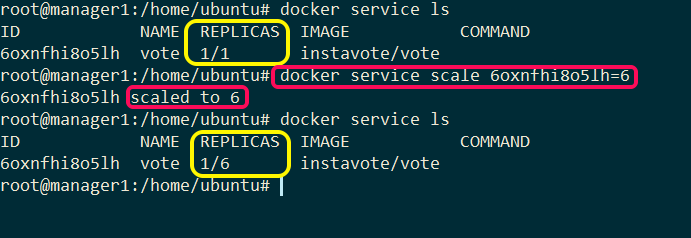

Run `docker service ps <SERVICE-ID>` will display the task node list on which it is running.

```
docker service ps 6oxnfhi8o5lh
```

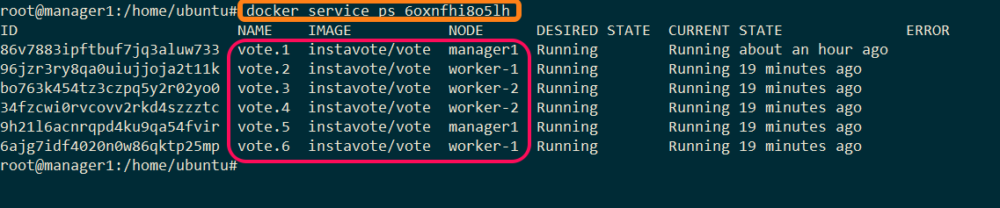

In visualizer you can see the detailed view about the number of running services and on various nodes.

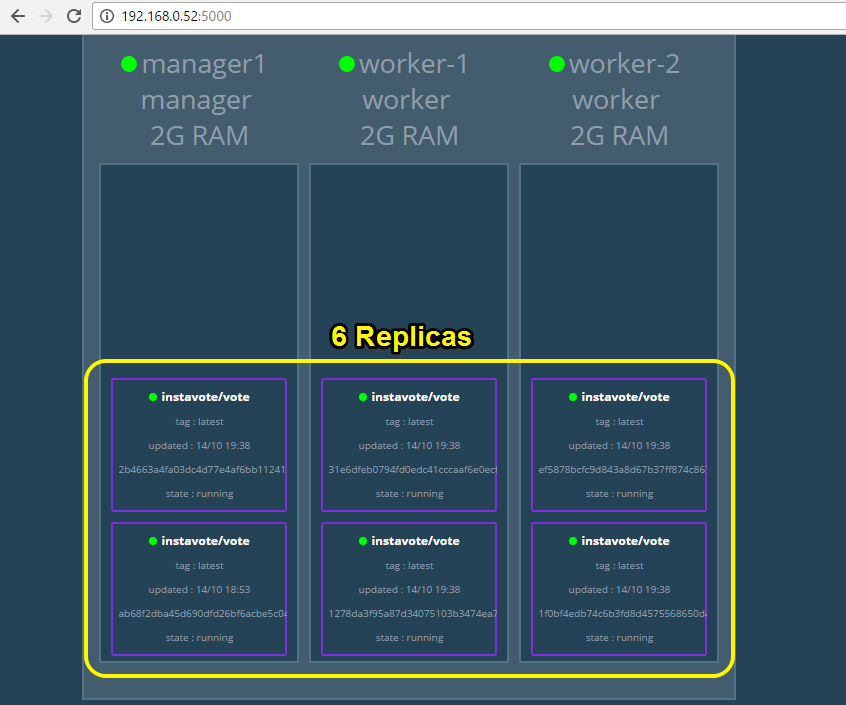

By visiting http://<IP>:8080 in browser we can see the output with a **various container ID's**.

- `IP` could be any of master or worker IP's, since it is a swarm service all will be redirected to the same.

- `8080` is the port that we specified while creating the service.

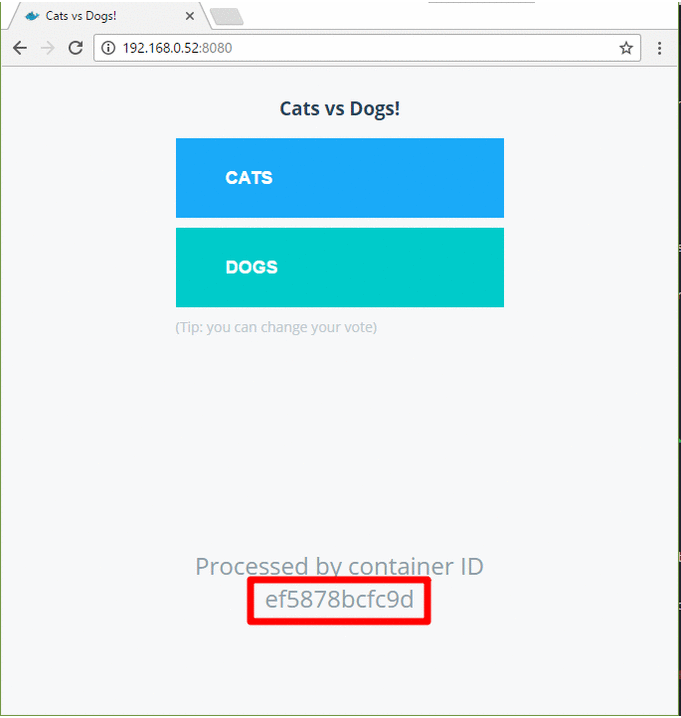

## Apply rolling updates to a service

Checking the existing swarm services by running `docker service inspect --pretty <SERVICE-ID>`

```
docker service inspect --pretty vote
```
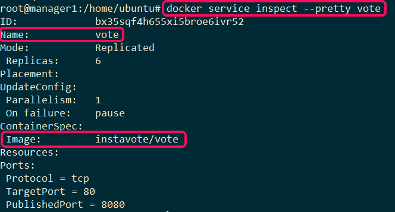

By running `docker service update --image <IMAGE_NAME> <SERVICE-ID|SERVICE-NAME>` the existing swarm service will be updated.

```
docker service update --image instavote/vote:movies vote
```

Now checking the swarm services by running `docker service inspect --pretty <SERVICE-ID>` will show the progress of update.

```
docker service inspect --pretty vote
```
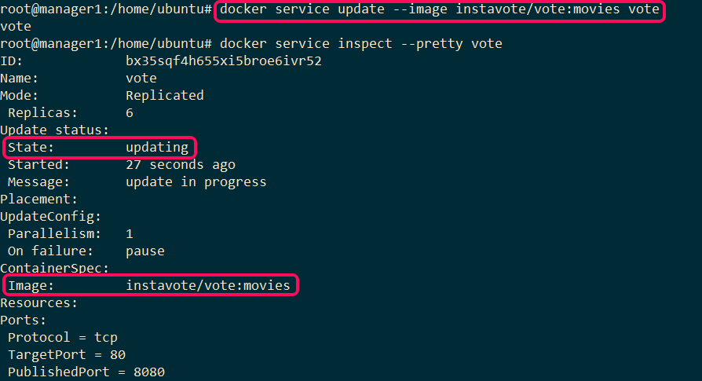

Run `docker service ps <SERVICE-ID>` to watch the rolling update

```
docker service ps vote
```
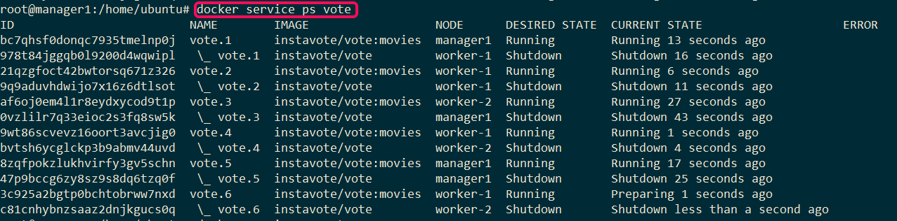

In docker-visualizer by visiting http://192.168.0.52:5000/ we can see the clearly updated service as follows

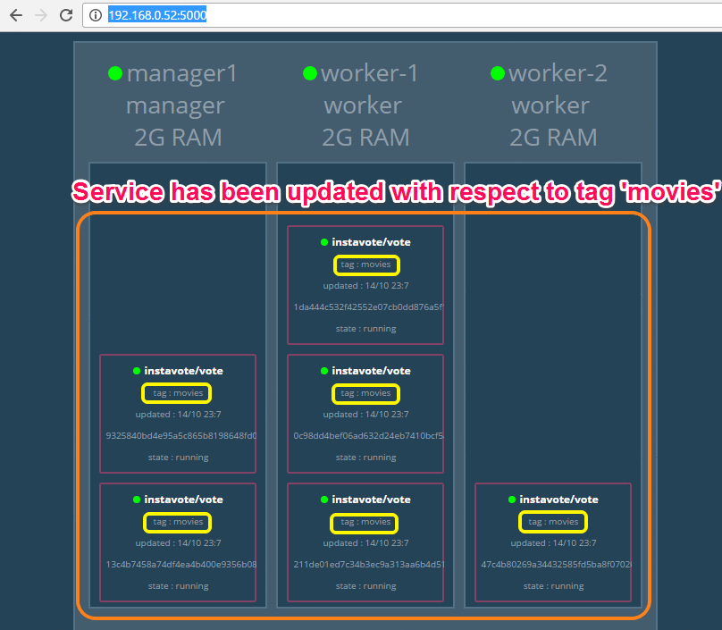

By visiting http://192.168.0.52:8080 in browser we can see the change in output with respect to the *service update* based on container image.

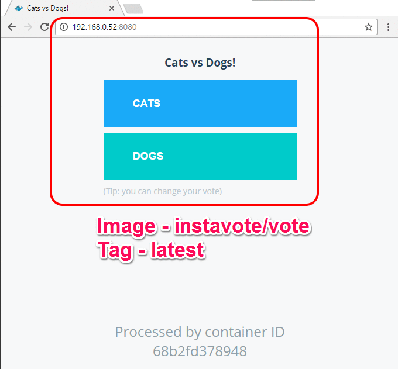

## Drain a node on the swarm

Availability for all nodes on swarm are set to be `ACTIVE`. Check the availability by running `docker node ls`.

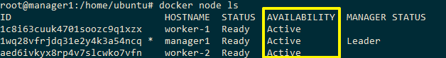

Let us assume that a node is taken for planned maintenance, in which you need to maintain/modify a node, at that time `MANAGER` should stop assigning tasks to such nodes.

Setting up `DRAIN` availability prevents the node from receiving new tasks from the swarm manager.

Thus manager will launch replica tasks on a node with `ACTIVE` availability.

Run `docker node update --availability drain <NODE-ID>` will drain a node in which the task has been assigned already.

```
docker node update --availability drain worker-1
```

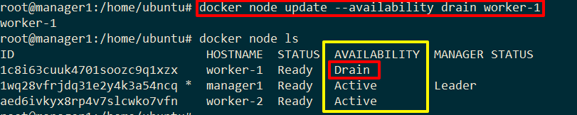

In visualizer we can clearly understand the `draining` process as follows

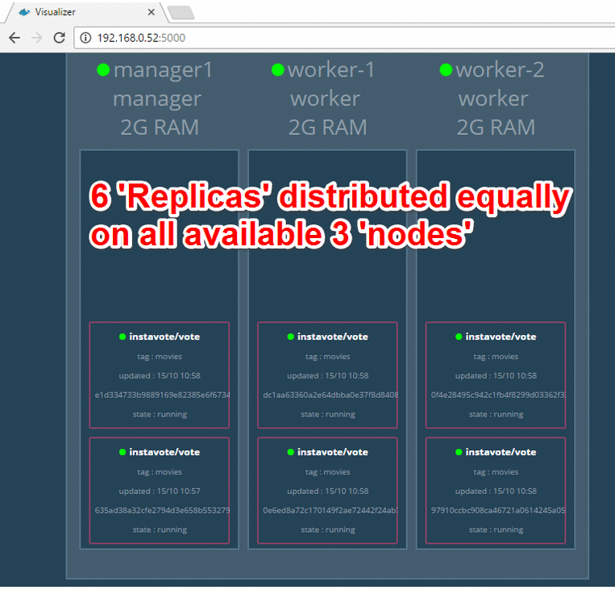

To set back active availability to the node just run `docker node update --availability active <NODE-ID>`, which will set the node to active and make it available for receiving new tasks from master.

## Removing Swarm Services

Run  `docker service rm <SERVICE-ID>` will remove the complete swarm service along with Replicas.

```
docker service rm 6oxnfhi8o5lh
```

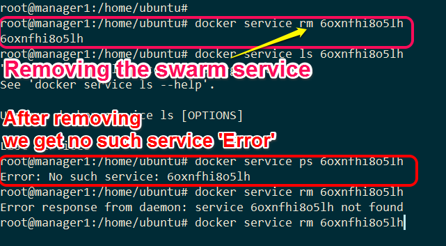
